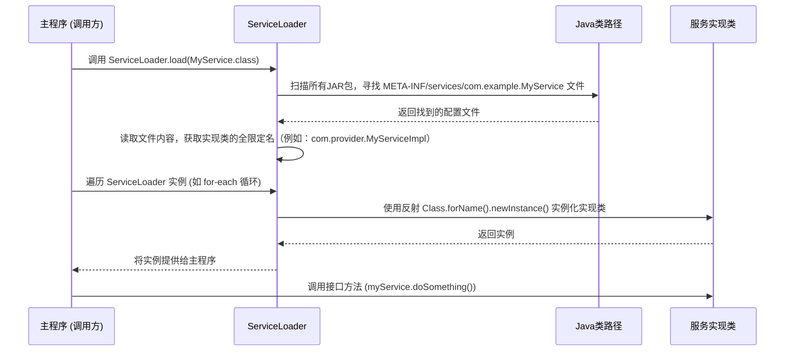

## Java SPI实践

我们来从“是什么”、“为什么”到“怎么用”和“最佳实践”一步步来剖析Java的SPI机制。

### 核心思想：接口与实现分离，实现动态“插拔”

想象一个场景：你的笔记本电脑有很多USB接口。这个 **USB接口标准** 就是一个 **约定（Interface）**。任何硬件厂商（比如罗技、闪迪）只要按照这个USB标准来生产他们的设备（鼠标、U盘），你的电脑就能识别并使用它们，而不需要你（电脑厂商）在出厂时就知道未来会有哪些USB设备。

Java SPI（Service Provider Interface，服务提供者接口）就是软件世界的“USB标准”。

> **一句话概括SPI：** Java官方定义了一套标准，允许在运行时动态地发现并加载实现了某个特定接口的类。其核心是 **“面向接口编程”** 和 **“依赖倒置”** 思想的体现，实现了调用方和实现方的彻底解耦。

-----

### SPI运行原理解析

SPI机制的核心是`java.util.ServiceLoader`类。它的工作流程可以用以下几个关键角色来解释：

1.  **服务接口 (Service Interface):** 就是我们上面说的“USB标准”。它是一个公开的`interface`或`abstract class`，定义了需要实现的功能。
2.  **服务提供者 (Service Provider):** 就是“USB设备制造商”。它是一个实现了上述服务接口的具体类。
3.  **配置文件:** 这是SPI的“魔法”所在。在服务提供者的JAR包中，必须在`META-INF/services/`目录下，创建一个以 **服务接口的全限定名** 命名的文件。文件的内容是 **服务实现类的全限定名**，可以有多个，每行一个。
4.  **服务加载器 (ServiceLoader):** 这是“USB端口管理器”。当你的主程序需要一个服务时，它会通过`ServiceLoader.load(服务接口.class)`来获取一个加载器实例。这个加载器会去扫描当前classpath下所有JAR包的`META-INF/services/`目录，找到对应的配置文件，读取里面的实现类名，并通过反射（`Class.forName().newInstance()`）来实例化这些服务提供者，而调用方对此过程完全无感知。

**运行时序图:**



这个机制最典型的应用就是 **JDBC**。你的项目中只依赖了JDBC的API（`java.sql.Driver`接口），并没有直接依赖任何具体的数据库驱动实现（如MySQL或PostgreSQL的驱动类）。当你把`mysql-connector-java.jar`放到classpath下时，`DriverManager`（其内部就使用了SPI）就能通过`META-INF/services/java.sql.Driver`文件找到`com.mysql.cj.jdbc.Driver`这个实现类，从而成功连接到MySQL数据库。如果你换成PostgreSQL的JAR包，程序代码一行都不用改，就能连接到PostgreSQL。

-----


### Java SPI机制的核心三要素

SPI核心流程：

1.  **定义 (The Contract - 合同):**
    * **角色:** 服务接口 (`interface` 或 `abstract class`)。
    * **目的:** 制定一套所有参与者都必须遵守的“游戏规则”。例如，`java.sql.Driver`接口定义了所有数据库驱动都必须具备的行为。
    * **产出:** 一个纯净的API JAR包 (`payment-api.jar`)。

2.  **实现 (The Provider - 服务提供方):**
    * **角色:** 实现了服务接口的具体类。例如，MySQL驱动中的`com.mysql.cj.jdbc.Driver`类。
    * **目的:** 提供规则的具体实现，完成实际的工作。
    * **产出:** 一个包含实现逻辑的业务JAR包 (`mysql-connector-java.jar`)。

3.  **映射/注册 (The Discovery Mechanism - 发现机制):**
    * **角色:** 实现方JAR包中的 `META-INF/services/` 目录下的配置文件。
    * **目的:** 这是一个“注册表”。它向整个Java运行时声明：“嘿，我这里有一个某某接口的实现，我的类名是这个，需要的时候可以来找我！”
    * **这是实现“自动映射”的关键，它在代码之外提供了一个连接点。**

4.  **加载/获取 (The Loader - 加载方):**
    * **角色:** 调用方代码中的 `java.util.ServiceLoader`。
    * **目的:** 作为“服务发现者”，它不关心具体的实现类是什么，只关心它需要的“接口”是什么。它会根据传入的接口 `Class` 对象，自动去所有classpath下的JAR包里寻找上面第3步提到的“注册表”文件。
    * **结果:** `ServiceLoader` 找到所有注册的实现类，并通过反射将它们实例化，然后提供给调用方使用。

所以，SPI机制概括为： **“定义 + 实现 + META-INF映射 = 通过定义加载即可获取”** 。

这个模式的巨大优势在于：

> **调用方在编译时完全不依赖任何具体的实现类，只依赖于抽象的接口。**

这使得添加、替换或移除一个“实现”变得极其简单，只需要在应用的classpath中增删对应的JAR包即可，完全符合软件设计中的**开闭原则（对扩展开放，对修改关闭）**。

-----

### 最佳实践：双项目实战

现在，我们来模拟一个真实的场景：一个支付系统。我们定义一个通用的支付API，然后用支付宝和微信支付作为两个独立的实现方。

#### 项目一：`payment-api` (服务接口定义方)

这个项目非常轻量，只包含接口定义。它像一个“规范”或“标准”，供所有其他项目依赖。

**1. 项目结构:**

```
payment-api
└── src
    └── main
        └── java
            └── com
                └── example
                    └── payment
                        └── PaymentService.java
└── pom.xml
```

**2. 定义服务接口 (`PaymentService.java`):**

```java
package com.example.payment;

import java.math.BigDecimal;

/**
 * 支付服务接口 (Service Interface)
 * 定义了支付的核心能力
 */
public interface PaymentService {

    /**
     * 支付方法
     * @param amount 支付金额
     * @return 支付成功返回 true，否则返回 false
     */
    boolean pay(BigDecimal amount);

    /**
     * 获取支付方式名称，例如 "Alipay", "WeChat Pay"
     * @return 支付方式名称
     */
    String getProviderName();
}
```

**3. `pom.xml` 配置:**

这个项目没有依赖，它被别人依赖。

```xml
<groupId>com.example</groupId>
<artifactId>payment-api</artifactId>
<version>1.0.0</version>
<packaging>jar</packaging>
```

**操作：** 对该项目执行`mvn clean install`，将其安装到本地Maven仓库。

-----

#### 项目二：`alipay-provider` (服务实现提供方)

这个项目是一个具体的支付实现，比如支付宝。

**1. 项目结构:**

```
alipay-provider
└── src
    └── main
        ├── java
        │   └── com
        │       └── example
        │           └── alipay
        │               └── AlipayService.java
        └── resources
            └── META-INF
                └── services
                    └── com.example.payment.PaymentService  <-- 关键配置文件
└── pom.xml
```

**2. 添加依赖:**

`alipay-provider`需要实现`payment-api`中定义的接口，所以必须依赖它。

**`pom.xml`:**

```xml
<dependencies>
    <dependency>
        <groupId>com.example</groupId>
        <artifactId>payment-api</artifactId>
        <version>1.0.0</version>
    </dependency>
</dependencies>

<groupId>com.example</groupId>
<artifactId>alipay-provider</artifactId>
<version>1.0.0</version>
```

**3. 实现接口 (`AlipayService.java`):**

```java
package com.example.alipay;

import com.example.payment.PaymentService;
import java.math.BigDecimal;

/**
 * 支付宝支付实现 (Service Provider)
 */
public class AlipayService implements PaymentService {

    @Override
    public boolean pay(BigDecimal amount) {
        System.out.println("使用支付宝支付了 " + amount + " 元。");
        // 模拟支付逻辑
        return true;
    }

    @Override
    public String getProviderName() {
        return "Alipay";
    }
}
```

**4. 创建SPI配置文件:**

这是将实现“注册”到SPI机制的关键一步。

  * **文件路径:** `src/main/resources/META-INF/services/com.example.payment.PaymentService`
  * **文件内容** (只有一行，即实现类的全限定名):
    ```
    com.example.alipay.AlipayService
    ```

**操作：** 同样对此项目执行`mvn clean install`。

-----

#### 协同运行：创建一个主应用来消费服务

现在我们创建一个主应用项目 `main-app` 来看看它们如何协同工作。

**1. `main-app` 项目结构和依赖:**

主应用需要：

1.  **依赖`payment-api`**: 因为它需要知道`PaymentService`这个接口是什么。
2.  **依赖`alipay-provider`**: 在运行时，需要将这个JAR包放入classpath，`ServiceLoader`才能找到它的实现。

**`pom.xml`:**

```xml
<dependencies>
    <dependency>
        <groupId>com.example</groupId>
        <artifactId>payment-api</artifactId>
        <version>1.0.0</version>
    </dependency>

    <dependency>
        <groupId>com.example</groupId>
        <artifactId>alipay-provider</artifactId>
        <version>1.0.0</version>
        <scope>runtime</scope>  
    </dependency>
</dependencies>
```

**2. 主应用代码 (`MainApplication.java`):**

```java
import com.example.payment.PaymentService;
import java.math.BigDecimal;
import java.util.ServiceLoader;
import java.util.Optional;

public class MainApplication {

    public static void main(String[] args) {
        // 1. 使用 ServiceLoader 加载所有可用的 PaymentService 实现
        ServiceLoader<PaymentService> loader = ServiceLoader.load(PaymentService.class);

        System.out.println("在Classpath中发现以下支付服务:");
        // 2. 遍历并打印所有找到的服务
        for (PaymentService service : loader) {
            System.out.println("- " + service.getProviderName());
        }

        // 3. 假设我们想用支付宝进行支付
        Optional<PaymentService> alipayService = findService(loader, "Alipay");

        if (alipayService.isPresent()) {
            System.out.println("\n尝试使用支付宝支付...");
            alipayService.get().pay(new BigDecimal("199.99"));
        } else {
            System.out.println("\n未找到支付宝支付服务。");
        }
    }

    // 一个简单的查找特定服务的方法
    private static Optional<PaymentService> findService(ServiceLoader<PaymentService> loader, String providerName) {
        // ServiceLoader 的 iterator 是懒加载的，每次迭代都会尝试实例化下一个 Provider
        // 为了可以重复使用，我们可以先加载到 List 中
        // loader.stream() 是 Java 8+ 的更现代的用法
        return loader.stream()
                .map(ServiceLoader.Provider::get) // 获取服务实例
                .filter(s -> providerName.equals(s.getProviderName()))
                .findFirst();
    }
}
```

**运行结果:**

当你运行`MainApplication`时，它的classpath上同时有`payment-api.jar`和`alipay-provider.jar`。`ServiceLoader`会扫描`alipay-provider.jar`中的`META-INF/services/`目录，找到并加载`AlipayService`。

输出将会是：

```
在Classpath中发现以下支付服务:
- Alipay

尝试使用支付宝支付...
使用支付宝支付了 199.99 元。
```

### 扩展性：增加一个微信支付

现在，如果我们要增加一个微信支付，**我们完全不需要修改 `payment-api` 和 `main-app` 的任何代码**。

我们只需要：

1.  创建一个新的Maven项目 `wechat-provider`。
2.  让它依赖 `payment-api`。
3.  创建一个`WeChatPayService`类实现`PaymentService`接口。
4.  在`wechat-provider`项目的`src/main/resources/META-INF/services/`下创建`com.example.payment.PaymentService`文件，内容为`com.example.wechat.WeChatPayService`。
5.  在`main-app`的`pom.xml`中增加对`wechat-provider`的`runtime`依赖。

<!-- end list -->

```xml
<dependency>
    <groupId>com.example</groupId>
    <artifactId>wechat-provider</artifactId>
    <version>1.0.0</version>
    <scope>runtime</scope>
</dependency>
```

再次运行`MainApplication`，输出会变为：

```
在Classpath中发现以下支付服务:
- Alipay
- WeChat Pay

尝试使用支付宝支付...
使用支付宝支付了 199.99 元。
```

看到了吗？`main-app`自动发现了新的服务，这就是SPI强大的可插拔能力。

### 总结与最佳实践

  * **职责单一原则:** API定义方（`payment-api`）应保持纯净，只包含接口和必要的数据模型，不应有任何实现。
  * **依赖范围(Scope):** 调用方对实现方的依赖应尽可能设置为`runtime`。这表示编译时只认接口，运行时才需要具体实现，这是一种更强的解耦。
  * **懒加载:** `ServiceLoader`是懒加载的。只有当你开始迭代它（例如使用for-each或`iterator()`）时，它才会真正去实例化服务。这在服务初始化很重的情况下非常有用。
  * **无状态服务:** SPI加载的服务实例最好是无状态的，这样可以被安全地共享和重用。如果需要状态，应考虑其生命周期管理。
  * **SPI 与 依赖注入(DI)框架:** Spring等现代DI框架提供了更强大、更灵活的bean管理能力。但SPI是Java底层的、更轻量级的标准机制。很多框架（如Dubbo、SLF4J）的底层都用到了SPI思想来实现其自身的扩展点加载。理解SPI有助于你更深刻地理解这些框架的设计。

SPI机制是Java平台一个经典而优雅的设计，是构建高扩展性、高解耦性系统的利器。