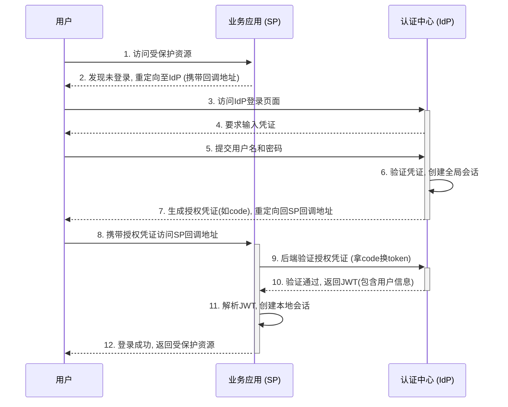

## SSO设计

### 一、 SSO 核心设计方案

单点登录（Single Sign-On，简称 SSO）的核心思想是“一次登录，处处通行”。用户只需在独立的身份提供商（IdP）登录一次，就可以访问所有相互信任的业务应用（SP），无需在每个应用中重复输入用户名和密码。

#### 1. 核心组件

一个典型的 SSO 系统包含以下三个核心角色：

*   **用户 (User)**：希望访问多个应用的最终用户。
*   **身份提供商 (Identity Provider, IdP)**：负责验证用户身份、维护全局登录状态，并向业务应用提供用户身份信息的服务。通常被称为“SSO认证中心”。
*   **服务提供商 (Service Provider, SP)**：指用户的目标业务应用，它信任 IdP 提供的身份信息。

#### 2. 架构图

#### 3. 详细流程

**登录流程 (Login Flow):**

1.  **用户访问SP**：用户首次访问业务应用（SP）的某个受保护页面。
2.  **SP检查会话**：SP检查本地是否存在用户的会话。如果不存在，说明用户未登录。
3.  **重定向至IdP**：SP将用户的浏览器重定向到IdP的登录页面。重定向时，通常会携带一个`redirect_uri`参数，告知IdP在认证成功后应该跳回哪个地址。
4.  **用户在IdP登录**：
    *   如果用户在IdP上也没有登录，IdP会展示登录页面，要求用户输入凭证（如用户名密码、二次验证码等）。
    *   如果用户已在IdP登录过（即存在全局会话），IdP会跳过此步骤。
5.  **IdP认证与授权**：IdP验证用户凭证。成功后，IdP会创建一个全局会话（通常通过在IdP域名下设置Cookie实现），并生成一个短暂的授权凭证（例如Authorization Code）。
6.  **IdP重定向回SP**：IdP将用户的浏览器重定向回第3步中SP提供的`redirect_uri`，并附上授权凭证。
7.  **SP获取访问令牌**：SP的后端服务收到前端带来的授权凭证后，向IdP发起一个后端请求，用该凭证换取一个正式的身份令牌（通常是JWT）。
8.  **SP创建本地会话**：SP验证收到的JWT的签名和内容，验证通过后，认为用户合法。SP为用户创建本地会話（例如，将JWT返回给前端存储），并授权用户访问其资源。

**登出流程 (Logout Flow / Single Log-Out, SLO):**

1.  **用户在SP登出**：用户在某个业务应用（SP1）上点击“登出”。
2.  **SP销毁本地会话**：SP1销毁自己的本地会话，并重定向用户到IdP的登出接口。
3.  **IdP销毁全局会话**：IdP接收到登出请求，销毁用户的全局会话（清除Cookie）。
4.  **IdP通知所有SP**：IdP查询该用户登录过的所有SP列表，并通过后端请求或前端重定向的方式，逐个通知这些SP执行登出操作。每个SP接收到通知后，销毁各自的本地会话。这是SLO中最复杂的一环。

#### 4. 标准协议详解 (以 OpenID Connect 授权码流程为例)

OpenID Connect (OIDC) 是构建在 OAuth 2.0 之上的身份认证层，是现代SSO最主流的实现标准。其核心流程“授权码流程” (Authorization Code Flow) 如下：

**第1步：发起授权请求 (SP -> IdP)**

SP通过浏览器重定向，将用户引导至IdP的授权端点 (`/authorize`)。

*   **请求方法**: `GET`
*   **示例URL**: `https://idp.com/authorize?response_type=code&scope=openid%20profile&client_id=sp_client_id&state=xyz&redirect_uri=https://sp.com/callback`
*   **核心请求参数 (Query Parameters)**:

| 参数 | 说明 |
| :--- | :--- |
| `response_type` | **必须**为 `code`。表示使用授权码流程。 |
| `client_id` | **必须**。SP在IdP注册时获得的客户端ID。 |
| `redirect_uri` | **必须**。IdP完成授权后重定向回SP的URL，必须与在IdP注册的回调地址完全一致。 |
| `scope` | **必须**包含 `openid`。可包含其他scope（如`profile`, `email`）来请求额外用户信息。 |
| `state` | **强烈推荐**。一个由SP生成的随机字符串，用于防止CSRF攻击。IdP会原样返回此参数。 |
| `nonce` | **推荐**。一个由SP生成的随机字符串，用于防止重放攻击，会包含在最终的`id_token`中。 |

**第2步：获取授权码 (IdP -> SP)**

用户在IdP完成登录和授权后，IdP将用户重定向回SP的`redirect_uri`。

*   **请求方法**: `GET` (浏览器重定向)
*   **示例URL**: `https://sp.com/callback?code=some_authorization_code&state=xyz`
*   **核心返回参数 (Query Parameters)**:

| 参数 | 说明 |
| :--- | :--- |
| `code` | IdP生成的、一次性有效的授权码，生命周期很短（通常为1-10分钟）。 |
| `state` | IdP原样返回SP在第一步中传递的`state`值。SP必须验证此值以确保请求的完整性。 |

**第3步：用授权码交换令牌 (SP Backend -> IdP)**

SP的后端服务收到`code`后，立即向IdP的令牌端点 (`/token`) 发起一个**后端HTTP请求**。

*   **请求方法**: `POST`
*   **Content-Type**: `application/x-www-form-urlencoded`
*   **核心请求参数 (Request Body)**:

| 参数 | 说明 |
| :--- | :--- |
| `grant_type` | **必须**为 `authorization_code`。 |
| `code` | **必须**。上一步中获取的授权码。 |
| `redirect_uri` | **必须**。与第一步中发送的`redirect_uri`完全相同。 |
| `client_id` | **必须**。SP的客户端ID。 |
| `client_secret` | **必须**。SP的客户端密钥，用于验证SP自身的身份。**此参数的存在决定了该请求必须在后端发起**。 |

**第4步：接收并解析令牌 (IdP -> SP Backend)**

IdP验证授权码和客户端密钥无误后，返回一个JSON对象，其中包含核心的`id_token`和`access_token`。

*   **核心返回数据 (JSON Response Body)**:

| 参数 | 说明 |
| :--- | :--- |
| `access_token` | OAuth 2.0的访问令牌，可用于请求IdP的用户信息端点 (`/userinfo`)。 |
| `token_type` | 通常为 `Bearer`。 |
| `expires_in` | `access_token`的有效期（秒）。 |
| `refresh_token` | (可选) 用于在`access_token`过期后，无需用户交互即可获取新的`access_token`。 |
| `id_token` | **OIDC的核心**。一个JWT格式的字符串，包含了用户的身份信息。 |

**第5步：验证 `id_token` 并创建本地会话**

SP的后端拿到`id_token`后，**必须**执行以下校验：
1.  **解析JWT**：分离出Header, Payload, Signature。
2.  **验证签名**：使用IdP的公钥验证JWT的签名是否有效。
3.  **验证Claims (声明)**：
    *   验证`iss` (Issuer) 是否为IdP的地址。
    *   验证`aud` (Audience) 是否包含自身的`client_id`。
    *   验证`exp` (Expiration Time) 是否晚于当前时间。
    *   验证`nonce`是否与第一步中发送的`nonce`一致。

所有验证通过后，SP便可信任`id_token`中的用户信息（如`sub`字段，即用户唯一标识），并为该用户创建自己的本地登录会话。

---

### 二、 SSO 最佳实践标准

1.  **强制使用HTTPS**：所有IdP和SP之间的通信，包括前端重定向和后端API调用，都必须使用HTTPS，防止凭证和令牌在传输过程中被窃取。
2.  **使用标准协议**：优先采用成熟的SSO协议，如 **OAuth 2.0 + OpenID Connect (OIDC)** 或 **SAML 2.0**。这能确保安全性和互操作性，避免自研协议带来的安全漏洞。
3.  **保护IdP**：IdP是整个系统的安全核心，必须采取最高级别的安全防护，包括防范DDoS攻击、暴力破解、SQL注入等。同时，IdP应支持多因素认证（MFA）以增强账户安全。
4.  **短生命周期的访问令牌**：业务应用使用的访问令牌（JWT）应设置较短的有效期（如15-60分钟），以降低令牌泄露后的风险。
5.  **使用刷新令牌（Refresh Token）**：配合短生命周期的访问令牌，为客户端提供刷新令牌。刷新令牌的有效期可以更长（如数天或数周），并存储在安全的地方（如HttpOnly的Cookie中），用于在访问令牌过期后静默获取新的访问令牌，提升用户体验。
6.  **安全的Cookie策略**：设置在IdP和SP域名下的Cookie应使用`HttpOnly`、`Secure`和`SameSite=Lax`或`Strict`属性，防止XSS攻击和CSRF攻击。
7.  **实现可靠的单点登出 (SLO)**：SLO实现复杂，但至关重要。可以采用后端通知机制，并为SP提供一个主动校验令牌有效性的接口，作为SLO通知失败时的补充。

---

### 三、 SSO 与 OAuth2 的关系与区别

这是两个经常被混淆但本质不同的概念。

*   **核心区别**：
    *   **SSO (单点登录)**：一个关于 **认证 (Authentication)** 的解决方案。它的核心目标是解决“用户是谁”的问题，让用户登录一次即可访问多个应用。
    *   **OAuth 2.0 (开放授权)**：一个关于 **授权 (Authorization)** 的协议。它的核心目标是解决“应用可以做什么”的问题，允许用户授权第三方应用访问其在某个服务上的特定资源，而无需共享密码。例如，“允许XX应用访问你的微信头像和昵称”。

*   **关系**：
    *   **SSO可以基于OAuth 2.0实现**。现代SSO系统广泛使用 **OpenID Connect (OIDC)** 协议，而OIDC正是构建在OAuth 2.0之上的一个身份认证层。
    *   在OIDC流程中，OAuth 2.0负责处理授权流程（如用户同意授权、颁发`access_token`），而OIDC在其之上增加了`id_token`（一个JWT），专门用于传递用户的身份信息，从而实现了SSO。
    *   简单来说：**OAuth 2.0 是授权框架，OIDC + OAuth 2.0 = 认证 + 授权 = 现代SSO解决方案**。

---

### 四、 JWT 在 SSO 中的作用

JWT (JSON Web Token) 在现代SSO（特别是基于OIDC的方案）中扮演着至关重要的角色，它是一种 **安全、紧凑、自包含** 的信息载体。

1.  **身份凭证 (Identity Token)**：
    *   当IdP成功认证用户后，会生成一个包含用户身份信息的JWT（在OIDC中称为`id_token`）。
    *   这个JWT包含了用户的基本信息，如用户ID (`sub`)、签发者 (`iss`)、受众 (`aud`)、过期时间 (`exp`) 等。还可以包含自定义的`claims`，如用户名、角色、部门等。

2.  **无状态验证**：
    *   SP收到JWT后，只需验证其签名即可信任其中的信息。由于JWT是自包含的，SP的后端API在收到后续请求时，可以直接从JWT中获取用户信息，而**无需每次都向IdP发起查询**。这极大地降低了IdP的压力，并提升了系统性能。

3.  **防篡改**：
    *   JWT由三部分组成：Header、Payload、Signature。Signature是使用IdP的私钥对前两部分进行签名的结果。
    *   任何一方如果试图修改Payload中的内容（如将普通用户角色改为管理员），由于没有IdP的私钥，无法生成有效的签名。SP在验证签名时会发现不匹配，从而拒绝该令牌，保证了信息的完整性和真实性。

---

### 五、 业务应用需要自己管理密钥吗？

这个问题的答案需要分两个层面来看：**对于IdP的信任验证** 和 **对于自身应用的会话管理**。

#### 层面一：验证IdP令牌时，SP不管理密钥

在SSO流程中，当SP需要验证从IdP收到的身份令牌（`id_token`）时，它扮演的是**验证方**角色。此时，遵循**信任中心化**原则：

*   **密钥管理模型**：采用非对称加密。
    *   **IdP (认证中心)**：持有**私钥**，用于对JWT进行签名。这是信任的根源。
    *   **SP (业务应用)**：持有IdP的**公钥**，用于验证JWT签名的有效性。

在这个层面，SP**绝对不能，也不需要**管理自己的密钥。它只需安全地获取并缓存IdP的公钥即可。IdP通常会通过一个公开的URL端点（如`.well-known/jwks.json`）来分发其公钥。

#### 层面二：SP生成内部会话令牌时，需要自己管理密钥

当SP验证IdP的令牌成功、确认用户身份后，通常会**生成一个属于SP自己的JWT**，用于在SP自身的前后端或微服务之间传递用户信息和权限。

**此时，SP必须使用自己独立的密钥来签发和验证这个内部JWT。**

*   **为何必须如此**：
    1.  **关注点分离**：IdP的JWT用于**跨系统身份认证**，而SP的内部JWT用于**应用内会话管理和授权**。后者可能包含更多应用专属信息（如应用角色、权限ID），这些信息IdP不应也无需关心。
    2.  **安全风险隔离**：IdP的私钥是SSO体系的最高机密。SP使用独立的密钥，意味着即便SP的密钥泄露，也**仅危及自身应用**，不会影响到整个SSO体系和其他SP的安全。这是至关重要的安全设计。
    3.  **自主与灵活**：SP可以独立管理其内部JWT的生命周期和内容，当用户权限变更时，可自行签发新令牌，无需与IdP交互。

*   **SP的密钥类型选择**：
    *   **对称密钥 (Symmetric Key)**：如果SP后端是单体应用，或前后端紧密耦合，使用一个高熵的共享密钥（Secret）通过**HMAC**算法签名即可，简单高效。
    *   **非对称密钥 (Asymmetric Keys)**：如果SP自身是微服务架构，可由其内部的“认证服务”使用私钥签发令牌，其他业务服务使用公钥验签，实现内部的信任传递。

**总结**：

| 场景 | 涉及的JWT | SP的角色 | 是否管理密钥 | 密钥类型 |
| :--- | :--- | :--- | :--- | :--- |
| **跨系统身份认证** | IdP签发的`id_token` | 验证方 | **否** (只需获取IdP公钥) | IdP的非对称密钥对 |
| **应用内部会话管理** | SP自己签发的`app_token` | 签发与验证方 | **是** (必须独立管理) | 对称或非对称密钥 |

---

### 六、 全局登录态与JWT时效性保障

这是一个关于用户体验和安全性平衡的关键问题。

*   **全局登录态 (IdP Session)**：
    *   **载体**：通常是IdP域名下的一个安全Cookie。
    *   **时效性**：**长周期**（例如8小时、1天或更长）。这决定了用户在多长时间内无需重新输入密码即可在不同应用间穿梭。
    *   **管理**：由IdP统一管理。用户在IdP上的任何活动都可以刷新这个会话的过期时间。

*   **业务应用JWT (Access Token)**：
    *   **载体**：由IdP签发，SP使用和验证的令牌。
    *   **时效性**：**短周期**（例如15分钟、1小时）。目的是为了降低JWT泄露后被恶意利用的风险。
    *   **管理**：由SP的客户端（如浏览器）存储，并在每次API请求时携带。

*   **如何协同工作（静默刷新机制）**：
    1.  用户的应用JWT过期了。
    2.  SP的客户端检测到JWT过期（例如API返回401错误）。
    3.  客户端**不会立即让用户重新登录**，而是通过一个隐藏的iframe或重定向，静默地访问IdP的授权端点。
    4.  因为用户的浏览器中还存有IdP的**有效全局会话Cookie**，IdP识别出用户是已登录状态。
    5.  IdP无需用户交互，直接生成一个新的授权凭证（code），并重定向回SP。
    6.  SP用新的code换取一个新的、短时效的JWT。
    7.  整个过程对用户透明，用户感觉自己一直处于登录状态。只有当IdP的全局会话也过期时，用户才需要重新输入密码。

这个机制完美地平衡了安全（JWT生命周期短）和用户体验（用户无需频繁登录）。

---

### 七、 SSO系统设计中的常见问题与解决方案

1.  **问题：单点故障 (Single Point of Failure)**
    *   **描述**：IdP成为整个系统的核心，一旦IdP宕机，所有应用的登录功能都会瘫痪。
    *   **解决方案**：
        *   **高可用部署**：对IdP服务进行集群化部署，使用负载均衡器分发流量。
        *   **异地多活/灾备**：在不同地理位置部署IdP实例，当一个数据中心出现问题时，可以快速切换到备用中心。
        *   **数据同步**：确保会话数据、用户数据在多个IdP实例之间实时同步。

2.  **问题：单点登出 (SLO) 的复杂性与不可靠性**
    *   **描述**：通知所有SP登出的过程可能因为网络问题或某个SP宕机而失败，导致部分应用未成功登出。
    *   **解决方案**：
        *   **后端通知与前端引导结合**：IdP后端尝试通知所有SP，同时前端可以嵌入多个隐藏的iframe来请求各个SP的登出接口。
        *   **令牌有效性校验接口**：SP应定期（或在执行敏感操作前）调用IdP的接口来校验当前JWT是否依然有效。如果IdP已将用户登出，该校验会失败，SP即可销毁本地会话。这是一种可靠的补偿机制。
        *   **接受最终一致性**：在某些场景下，可以接受登出状态的短暂不一致。

3.  **问题：令牌安全与泄露风险**
    *   **描述**：JWT如果被截获，攻击者可以在其有效期内冒充用户。
    *   **解决方案**：
        *   **强制HTTPS**：从根源上防止中间人攻击。
        *   **缩短JWT有效期**：将风险窗口降到最低。
        *   **令牌吊销列表 (Token Revocation List)**：IdP可以维护一个已吊销令牌的列表。SP在校验令牌时，除了验证签名，还需查询该列表。但这会增加IdP的负担，破坏JWT无状态的优点，需谨慎使用。
        *   **安全存储**：在浏览器端，将刷新令牌等敏感信息存储在`HttpOnly`的Cookie中，防止被JavaScript脚本窃取。

4.  **问题：跨域问题 (CORS)**
    *   **描述**：IdP和多个SP通常部署在不同域名下，前端JavaScript交互会遇到跨域限制。
    *   **解决方案**：
        *   **IdP配置CORS策略**：在IdP服务器上设置CORS响应头，明确允许来自SP域名的跨域请求。
        *   **JSONP（不推荐）**：老旧且不安全的方案，应避免使用。
        *   **代理**：在SP的后端设置一个代理接口，由后端代替前端与IdP通信，避免浏览器跨域。