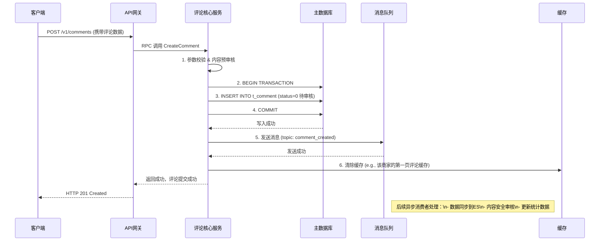
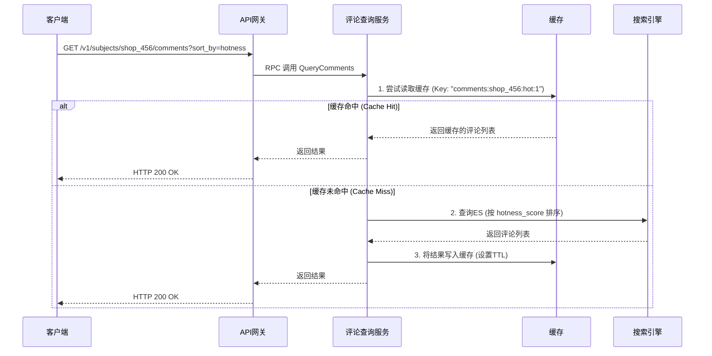

## 评论系统设计

本文要设计一个评论系统，参考“大众点评”的实现。

### **1. 核心挑战分析 (Core Challenges)**

设计一个“大众点评”级别的评论系统，我们面临的核心挑战与通用网站的评论系统有显著不同，主要体现在以下几个方面：

  * **海量数据 & 高并发读写：**

      * **写入 (Write):** 每天可能有数百万甚至上千万的新评论、点赞、回复产生。写操作必须高效、可靠，并保证数据一致性。
      * **读取 (Read):** 读取量远大于写入量（通常为10:1甚至100:1）。用户浏览商家、商品时，会高并发地拉取评论列表。读取性能是系统的生命线。
      * **读写模式不一：** 写入是事务性的，要求强一致性；读取是信息流式的，要求高性能和最终一致性，并且有复杂的多维度查询需求（如排序、筛选）。

  * **复杂查询需求 (Complex Queries):**

      * **多维度排序：** 按时间最新、按热度（点赞数、回复数）、按评价等级（好评/差评）等。
      * **多维度筛选：** 按是否有图、按评价标签（如“服务好”、“环境优雅”）、按用户等级等。
      * **个性化推荐：** 根据用户画像，展示好友的评论或“可能感兴趣”的评论。

  * **服务高可用与数据可靠性 (High Availability & Reliability):**

      * 评论是用户的核心资产，绝对不能丢失。
      * 作为核心服务，评论服务的任何抖动都会直接影响用户体验和交易转化率，必须保证99.99%以上的可用性。

  * **内容安全与反作弊 (Content Security & Anti-Spam):**

      * 需要有效识别和处理垃圾广告、恶意评价、虚假评论（刷单）等。这是一个持续对抗的过程。

  * **低延迟要求 (Low Latency):**

      * 用户打开页面，评论列表必须在毫秒级加载完成，否则会严重影响用户体验。

### **2. 总体架构设计 (High-Level Architecture)**

基于以上挑战，我们将采用**微服务架构**、**读写分离**、**数据异构**的核心思想来构建系统。

  * **API Gateway (API 网关):**
      * **职责：** 统一入口，负责认证、鉴权、路由、限流、熔断、日志等通用功能。客户端（App/Web）的所有请求都先经过网关。
  * **Comment Service (评论核心服务):**
      * **职责：** 系统的核心，处理所有评论的**写操作**（发布、删除、修改）和部分**读操作**（如获取单条评论详情）。它是数据一致性的唯一保障者。
      * **特点：** 无状态服务，可水平扩展。
  * **Comment Feed/Search Service (评论查询/搜索服务):**
      * **职责：** 处理所有复杂的**读操作**，如获取评论列表、排序、筛选。数据源来自搜索引擎，与核心服务解耦。
      * **特点：** 高性能、高可用，针对读优化。
  * **依赖的中间件 (Middleware):**
      * **数据库 (MySQL/PostgreSQL):** 存储评论的主数据，保证事务和数据一致性。采用分库分表策略来应对海量数据。
      * **搜索引擎 (Elasticsearch):** 用于评论的搜索、筛选和聚合。评论数据通过消息队列从主库同步到ES。这是解决复杂查询需求的关键。
      * **分布式缓存 (Redis):**
          * **结果缓存：** 缓存热点商家的第一页评论，大幅降低DB和ES的压力。
          * **计数器缓存：** 缓存评论的点赞数、回复数等，避免频繁写DB。
          * **分布式锁：** 用于处理并发场景。
      * **消息队列 (Kafka/Pulsar):**
          * **系统解耦：** 评论核心服务完成写操作后，将数据变更消息发送到MQ，由下游消费者（如ES同步、内容审核、消息推送等）异步处理。
          * **削峰填谷：** 应对突发的写入高峰。
  * **后台异步任务 (Backend Async Tasks):**
      * **数据同步 (Data Sync):** 消费MQ消息，将MySQL中的评论数据同步到Elasticsearch。
      * **内容审核 (Content Moderation):** 调用第三方或自研的AI审核服务，对评论进行黄、赌、毒、广告等内容的机审和人审。
      * **统计与计算 (Stats & Calculation):** 异步计算评论的热度分、商家的总评分等。

### **3. 模块详细设计 (Detailed Module Design)**

##### **3.1 API 设计 (RESTful API)**

```
// 发布新评论
POST /v1/comments
Body: {
  "user_id": 123,
  "subject_id": "shop_456", // 评论对象ID，如商铺、商品
  "subject_type": "shop",    // 评论对象类型
  "content": "这家店味道真不错！",
  "rating": 5,               // 评分
  "images": ["url1", "url2"],
  "parent_id": 0             // 0表示主评论，非0表示回复
}

// 查询评论列表
GET /v1/subjects/{subject_id}/comments
Query Params:
  ?page=1
  &size=10
  &sort_by=hotness // hotness, time_desc, time_asc
  &filter=has_image // has_image, high_rating

// 删除评论（逻辑删除）
DELETE /v1/comments/{comment_id}

// 点赞评论
POST /v1/comments/{comment_id}/like
```

##### **3.2 数据模型设计 (Data Model)**

**MySQL 主表 (存储核心数据)**

采用**分库分表**策略，例如按 `subject_id` 的哈希值进行分片，将同一个商家的评论落到同一个库表中，便于后续查询。

`comments` 表 (`t_comment_0000` to `t_comment_1023`):

```sql
CREATE TABLE `t_comment_xxxx` (
  `id` BIGINT UNSIGNED NOT NULL AUTO_INCREMENT COMMENT '评论ID',
  `comment_id` BIGINT UNSIGNED NOT NULL COMMENT '全局唯一评论ID (由雪花算法生成)',
  `subject_id` VARCHAR(128) NOT NULL COMMENT '评论对象ID',
  `subject_type` TINYINT NOT NULL COMMENT '对象类型 1:商铺 2:商品',
  `user_id` BIGINT UNSIGNED NOT NULL COMMENT '用户ID',
  `parent_id` BIGINT UNSIGNED NOT NULL DEFAULT 0 COMMENT '父评论ID，用于回复',
  `content` TEXT COMMENT '评论内容',
  `rating` TINYINT UNSIGNED NOT NULL DEFAULT 0 COMMENT '评分 (1-5)',
  `images` JSON COMMENT '图片列表',
  `videos` JSON COMMENT '视频列表',
  `tags` VARCHAR(255) COMMENT '标签',
  `status` TINYINT NOT NULL DEFAULT 0 COMMENT '状态 0:待审核 1:审核通过 2:用户删除 3:审核驳回',
  `like_count` INT UNSIGNED NOT NULL DEFAULT 0 COMMENT '点赞数',
  `reply_count` INT UNSIGNED NOT NULL DEFAULT 0 COMMENT '回复数',
  `create_time` DATETIME(3) NOT NULL DEFAULT CURRENT_TIMESTAMP(3),
  `update_time` DATETIME(3) NOT NULL DEFAULT CURRENT_TIMESTAMP(3) ON UPDATE CURRENT_TIMESTAMP(3),
  PRIMARY KEY (`id`),
  UNIQUE KEY `uk_comment_id` (`comment_id`),
  KEY `idx_subject_user` (`subject_id`, `user_id`),
  KEY `idx_create_time` (`create_time`)
) ENGINE=InnoDB DEFAULT CHARSET=utf8mb4;
```

  * **`comment_id`**: 全局唯一ID，使用Snowflake等算法生成，避免分库分表后主键冲突。
  * **`status`**: 审核状态，新评论默认为“待审核”，通过异步任务更新状态。

**Elasticsearch 文档 (用于搜索和读取)**

ES文档是一个宽表（denormalized），包含所有用于查询和展示的字段，避免查询时的多表JOIN。

```json
{
  "comment_id": 1234567890123456,
  "subject_id": "shop_456",
  "subject_type": 1,
  "user_id": 123,
  "user_info": { // 用户信息冗余
    "nickname": "架构师小明",
    "avatar": "url_to_avatar",
    "level": 5
  },
  "parent_id": 0,
  "content": "这家店味道真不错！",
  "rating": 5,
  "images": ["url1", "url2"],
  "tags": ["服务好", "环境优雅"],
  "status": 1, // 只同步审核通过的评论
  "like_count": 102,
  "reply_count": 5,
  "hotness_score": 98.7, // 热度分，通过异步计算得出
  "create_time": "2025-08-26T10:00:00Z"
}
```

##### **3.3 核心流程时序图 (Sequence Diagram)**

**发布评论 (写流程)**



**查询评论列表 (读流程)**



### **4. 核心逻辑 Go 源码实现**

以下是评论核心服务 `Comment Service` 中“发布评论”的核心逻辑伪代码，展示了其设计思路和分层。

**目录结构 (简化)**

```
/comment_service
  /cmd
    main.go
  /internal
    /handler    // HTTP/RPC 处理器
      comment_handler.go
    /service    // 业务逻辑层
      comment_service.go
    /repository // 数据访问层
      comment_repo.go
      mq_producer.go
      cache_repo.go
    /model      // 数据模型
      comment.go
  /pkg
    /snowflake  // 雪花算法
```

**`internal/model/comment.go`**

```go
package model

import "time"

type Comment struct {
	ID          int64     `json:"id" db:"id"`
	CommentID   int64     `json:"comment_id" db:"comment_id"`
	SubjectID   string    `json:"subject_id" db:"subject_id"`
	SubjectType int8      `json:"subject_type" db:"subject_type"`
	UserID      int64     `json:"user_id" db:"user_id"`
	ParentID    int64     `json:"parent_id" db:"parent_id"`
	Content     string    `json:"content" db:"content"`
	Rating      int8      `json:"rating" db:"rating"`
	Images      []string  `json:"images" db:"images"` // 在DB中可以用JSON类型
	Status      int8      `json:"status" db:"status"`
	CreateTime  time.Time `json:"create_time" db:"create_time"`
	UpdateTime  time.Time `json:"update_time" db:"update_time"`
}

type CreateCommentRequest struct {
	SubjectID   string   `json:"subject_id" binding:"required"`
	SubjectType int8     `json:"subject_type" binding:"required"`
	UserID      int64    `json:"user_id" binding:"required"`
	ParentID    int64    `json:"parent_id"`
	Content     string   `json:"content" binding:"required"`
	Rating      int8     `json:"rating" binding:"gte=0,lte=5"`
	Images      []string `json:"images"`
}

// Kafka消息结构
type CommentMessage struct {
	Type      string   `json:"type"` // "create", "delete"
	Comment   *Comment `json:"comment"`
}
```

**`internal/service/comment_service.go`** (核心业务逻辑)

```go
package service

import (
	"context"
	"encoding/json"
	"fmt"
	"time"

	"comment_service/internal/model"
	"comment_service/internal/repository"
	"comment_service/pkg/snowflake"
)

// 定义依赖接口，方便单元测试和解耦
type CommentRepo interface {
	Create(ctx context.Context, comment *model.Comment) error
}

type MessageQueueProducer interface {
	Publish(ctx context.Context, topic string, key string, payload []byte) error
}

type CacheRepo interface {
	ClearSubjectCommentCache(ctx context.Context, subjectID string) error
}

type CommentService struct {
	repo     CommentRepo
	producer MessageQueueProducer
	cache    CacheRepo
}

func NewCommentService(repo CommentRepo, producer MessageQueueProducer, cache CacheRepo) *CommentService {
	return &CommentService{
		repo:     repo,
		producer: producer,
		cache:    cache,
	}
}

// CreateComment 是核心的创建评论方法
func (s *CommentService) CreateComment(ctx context.Context, req *model.CreateCommentRequest) (*model.Comment, error) {
	// 1. 内容风控预检查 (可以调用一个简单的同步检查，如关键词过滤)
	if isSpam(req.Content) {
		return nil, fmt.Errorf("content contains sensitive words")
	}

	// 2. 构建Comment对象
	comment := &model.Comment{
		CommentID:   snowflake.GenID(), // 使用雪花算法生成唯一ID
		SubjectID:   req.SubjectID,
		SubjectType: req.SubjectType,
		UserID:      req.UserID,
		ParentID:    req.ParentID,
		Content:     req.Content,
		Rating:      req.Rating,
		Images:      req.Images,
		Status:      0, // 初始状态为“待审核”
		CreateTime:  time.Now(),
		UpdateTime:  time.Now(),
	}

	// 3. 写入主数据库 (Repository层会处理分库分表逻辑)
	// 这里包含了一个事务
	if err := s.repo.Create(ctx, comment); err != nil {
		// Log error
		return nil, fmt.Errorf("failed to save comment to db: %w", err)
	}

	// 4. 发送异步消息到Kafka，用于数据同步和后续处理
	// 这一步是非阻塞的，即使失败也不应影响主流程的成功返回
	// 但需要做好监控和重试
	go func() {
		msg := model.CommentMessage{
			Type:    "create",
			Comment: comment,
		}
		payload, _ := json.Marshal(msg)
        // 使用带超时的context
		publishCtx, cancel := context.WithTimeout(context.Background(), 2*time.Second)
		defer cancel()

		err := s.producer.Publish(publishCtx, "comment_events", comment.SubjectID, payload)
		if err != nil {
			// 记录日志，并告警
			fmt.Printf("Error: failed to publish message to kafka: %v\n", err)
		}
	}()

	// 5. 清除相关缓存 (Cache-Aside Pattern中的写操作)
	// 清除该商家下的评论列表缓存，保证下次读取时能获取最新数据
	go func() {
		// 同样使用独立的context
		cacheCtx, cancel := context.WithTimeout(context.Background(), 1*time.Second)
		defer cancel()
		if err := s.cache.ClearSubjectCommentCache(cacheCtx, comment.SubjectID); err != nil {
			// 记录日志
			fmt.Printf("Warning: failed to clear cache for subject %s: %v\n", comment.SubjectID, err)
		}
	}()

	return comment, nil
}

func isSpam(content string) bool {
	// 简单的关键词检查逻辑
	// 复杂的应调用风控服务
	return false
}
```

### **5. 高可用与可扩展性设计 (HA & Scalability)**

  * **无状态服务：** 所有服务（Comment Service, Search Service）都是无状态的，可以部署多个实例，通过负载均衡（如Nginx, K8s Service）分发流量，轻松实现水平扩展。
  * **数据库扩展：**
      * **读写分离：** 主库处理写，多个从库处理部分读请求（如后台管理系统的查询）。
      * **分库分表：** 使用如 `subject_id` HASH 的方式进行水平分片，将压力分散到多个物理库上。
  * **缓存策略：**
      * 热点数据缓存：对高频访问的商家第一页评论进行缓存，设置较短的过期时间（如1-5分钟）。
      * 缓存击穿/雪崩防护：使用分布式锁保证同一时间只有一个请求回源；设置随机过期时间。
  * **异步解耦：** 通过消息队列，核心服务与非核心任务（审核、同步）解耦。即使下游服务暂时不可用，核心的评论发布功能也不受影响。
  * **服务降级与熔断：** 当非核心依赖（如用户服务、风控服务）出现故障时，可以降级处理（如暂时不显示用户信息，或跳过预审核），保证核心功能可用。API网关层面配置熔断规则，避免雪崩效应。
  * **限流：** 在网关和Service层针对用户ID、IP地址、接口路径设置不同维度的限流策略，防止恶意攻击。

### **6. 总结 (Conclusion)**

此设计方案遵循了大型互联网公司的最佳实践，核心思想在于：

1.  **服务拆分 (Service Decomposition):** 将单一的评论功能拆分为职责明确的微服务，便于独立开发、部署和扩展。
2.  **读写分离 (CQRS - Command Query Responsibility Segregation):** 写操作由`Comment Service`处理，保证数据一致性；复杂的读操作由`Search Service`处理，追求极致性能。
3.  **数据异构 (Data Heterogeneity):** 针对不同场景使用最合适的存储方案。MySQL负责事务和主数据存储，Elasticsearch负责搜索和分析，Redis负责缓存和加速。
4.  **最终一致性 (Eventual Consistency):** 通过消息队列实现数据的异步同步，接受读写路径之间短暂的数据不一致，以换取系统整体的高性能和高可用性。

这套架构不仅能满足大众点评级别的海量评论需求，而且具备良好的可扩展性和容错能力，可以作为构建任何大规模、高并发系统的通用范本。